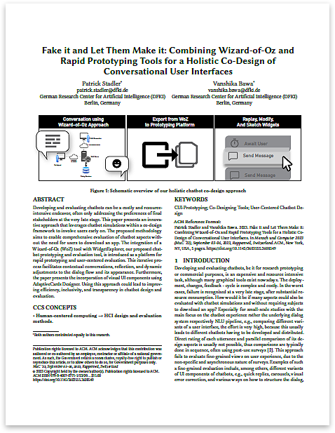

Accompanying web page with additional information and supplements for the Mensch und Computer 2023[^1] short paper: "Fake it and Let Them Make it: Combining Wizard-of-Oz and Rapid Prototyping Tools for a Holistic Co-Design of Conversational User Interfaces" by Patrick Stadler[^2] and Vanshika Bawa[^3], German Research Center for Artificial Intelligence (DFKI)[^4]. 2023, Berlin, Germany.

## Abstract

**Developing and evaluating chatbots can be a costly and resource-intensive endeavor, often only addressing the preferences of final stakeholders at the very late stage. This paper presents an innovative approach that leverages chatbot simulations within a co-design framework to involve users early on. The proposed methodology aims to enable comprehensive evaluation of chatbot aspects without the need for users to download an app. The integration of a Wizard-of-Oz (WoZ) tool with WidgetExplorer, our proposed chatbot prototyping and evaluation tool, is introduced as a platform for rapid prototyping and user-centered evaluation. This iterative process facilitates contextual conversations, reflection, and dynamic adjustments to the dialog flow and its appearance. Furthermore, the paper presents the incorporation of visual UI components using AdaptiveCards Designer. Using this approach could lead to improving efficiency, inclusivity, and transparency in chatbot design and evaluation.**

## Paper

The paper can be found in the ACM Digital Library.

<em>Click the image above to open the paper (ACM Digital Library)</em>

## Wizard Of Oz
We use our Wizard of Oz platform as a straightforward way to conduct natural language dialogues with users and potential stakeholders. This also allows for a realistic discussion, in which one person takes the role of the user, while the other person can act out the responses of themselves, or a chatbot, depending on the desired scenario. Usually non-experts, i.e., users, talk to a researcher via the WoZ setup, but it is also imaginable to substitute the researcher for another non-expert, allowing for a true dialog along some prepared tasks. Another advantage of the WoZ approach lies in the fact that the resulting data is already available in digital form and can therefore be easily processed in a next step.

## WidgetExplorer

TODO

## Our Holistic Approach

TODO

## Download Components

TODO

## Citation

Patrick Stadler and Vanshika Bawa. 2023. Fake it and Let Them Make it: Combining Wizard-of-Oz and Rapid Prototyping Tools for a Holistic Co-Design of Conversational User Interfaces. In Mensch und Computer 2023 (MuC ’23), September 03–06, 2023, Rapperswil, Switzerland. ACM, New York, NY, USA, 5 pages. https://doi.org/10.1145/3603555.3608549

[^1]: https://muc2023.mensch-und-computer.de/
[^2]: https://orcid.org/0000-0002-5224-1522
[^3]: https://orcid.org/0009-0008-9585-8902
[^4]: https://www.dfki.de/en/web/research/research-departments/cognitive-assistants
